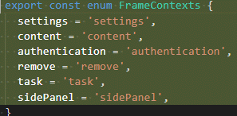

# Create apps for Teams meetings

## Meeting apps API reference

|API|Description|Request|Source|
|---|---|----|---|
|**GetParticipant**|This API allows a bot to fetch a participant information by meeting id and participant id.|**GET** _**/v1/meetings/{meetingId}/participants/{participantId}?tenantId={tenantId}**_ |Microsoft Graph|
|**NotificationSignal** |Meeting signals will be delivered using the following existing conversation notification API (for user-bot chat). This API allows developers to signal based on end-user action to show-case an in-meeting notification bubble.|**POST** _**/v3/conversations/{conversationId}/activities**_|Microsoft Bot Framework SDK|
|**GetUserContext**| Get contextual information to display relevant content in a Teams tab. |_**microsoftTeams.getContext( ( ) => {  /*...*/ } )**_|Microsoft Teams client SDK|

### GetParticipant API

#### Request

```http
GET /v1/meetings/{meetingId}/participants/{participantId}?tenantId={tenantId}
```

### Query parameters

**meetingId**. The meeting identifier is required.  
**participantId**. The participant identifier is required.  
**tenantId**. Tenant id of the participant. Required for tenant user.

### Response Payload
<!-- markdownlint-disable MD036 -->

**Example 1**

```json
{
    "meetingRole":"<meeting role>",
    "conversation":
        {
            "id": "<conversation id>"
        }
}
```

**meetingRole** can be *organizer*, *presenter*, or *attendee*.

**Example 2**

```json
{
    "meetingRole": "Attendee",
    "conversation": {
        "isGroup": true,
        "id": "sample" }
}
```

### Response Codes

**200**: participant information successfully retrieved  
**401**: invalid token  
**403**: the app is not allowed to get participant information. There can be many reasons: app disabled by tenant admin, blocked during live site mitigation, etc.  
**404**: the meeting doesn't exist or participant can’t be found  

<!-- markdownlint-disable MD024 -->
### NotificationSignal API

#### Request

```http
POST /v3/conversations/{conversationId}/activities
```

### Query parameters

**conversationId**: The conversation identifier. Required

### Request Payload

```json
{
"channelData": {
    "notification": {
        "alertMeeting": true,

        "externalResourceUrl: "https://teams.microsoft.com/l/bubble/APP_ID?url=<TaskInfo.url>&height=<TaskInfo.height>      &width=<TaskInfo.width> &title=<TaskInfo.title> ”
                      }
                 }
            }
```

**Example 1 Node.js**

```nodejs
const replyActivity = MessageFactory.text('Hi'); // this could be an adaptive card instead
        replyActivity.channelData = {
            notification: {
                alertInMeeting: true,
                externalResourceUrl: 'https://teams.microsoft.com/l/bubble/APP_ID?url=<TaskInfo.url> &height=<TaskInfo.height>      &width=<TaskInfo.width> &title=<TaskInfo.title>’
            }
        };
        await context.sendActivity(replyActivity);
```

**Example 2 C#**

```csharp
var replyActivity = MessageFactory.text('Hi'); // this could be an adaptive card insteadreplyActivity.ChannelData = new TeamsChannelData{
    Notification: new NotificationInfo(alertInMeeting: true, externalResourceUrl: 'https://teams.microsoft.com/l/bubble/APP_ID?url=<TaskInfo.url> &height=<TaskInfo.height>      &width=<TaskInfo.width> &title=<TaskInfo.title>’
};
await context.sendActivity(replyActivity);
```

### Response Codes

**201**: activity with signal is successfully sent
**401**: invalid token
**403**: the app is not allowed to send the signal. In this case, the payload should contain more detail error message. There can be many reasons: app disabled by tenant admin, blocked during live site mitigation, etc.
**404**: the meeting chat doesn't exist

### GetUserContext

Please refer to our [Get context for your Teams tab](../tabs/how-to/access-teams-context.md#getting-context-by-using-the-microsoft-teams-javascript-library) documentation for guidance on identifying and  retrieving contextual information for your tab content. As part of meetings extensibility, new values have been added for the request payload:

1. **meetingId**: used by a tab when running in the meeting context.   

1. **tenantId - tid**: Azure AD tenant ID of the current user.  

1. **ParticipantId** - userObjectId: The Azure AD object id of the current user, in the current tenant"


## Enable your app for Teams meetings

### Update your app manifest

The meetings app capabilities are declared in your app manifest via the **configurableTabs** -> **meetingSurfaces** array. The array accepts two optional configuration — **sidePanel** (he right pane in-meeting experience for the app) or **stage**. the **sidePanel** is t and “stage” (rendered in the main shared view of the meeting (as with Whiteboard and InVision today).  

```json
"configurableTabs": [
    {
      "configurationUrl": "https://contoso.com/teamstab/configure",
      "canUpdateConfiguration": true,
      "meetingSurfaces": [
        "sidePanel",
        "stage"
      ],
      "scopes": [
        "team",
        "groupchat"
      ]
    }
  ]
```

## Configure your app for meeting scenarios

> [!NOTE]
> For your app to be visible in the tab gallery it needs to **support configurable tabs** and the **group chat scope**.

### Pre-meeting

Users with organizer and/or presenter roles can add tabs using the plus ➕ button in the meeting **Chat** and meeting **details** pages.

✔ Once the user identity is confirmed, via Tabs SSO, the app can use **userObjectId** and **meetingId** provided from the TeamsSDK to retrieve the user role via GetParticipant API.

 ✔ Based on the user role, the app will now have the capability to present role specific experiences. For example, a polling app can allow only organizers and presenters to create a new poll.

### In-meeting

The **side-panel** and **stage** surfaces (specified in the app manifest) provide the surfaces for app access and interaction.

#### **side-panel**

✔ In your app manifest add **sidePanel** to the **meetingSurfaces** array as described above.

✔ In the meeting, the app will be rendered in a 320&times;320 px right pane. Your tab must be optimized for this.

✔Refer to the Tab SDK section to use the **userContext** API to route requests accordingly.

✔ Refer to the [Teams authentication flow for tabs](../tabs/how-to/authentication/auth-flow-tab.md).

#### **stage**

✔ In your app manifest add **sidePanel** to the **meetingSurfaces** array as described above.

✔ In the meeting, the app will be available in the Share Tray (similar to Whiteboard).

✔ Refer to the [Teams authentication flow for tabs](../tabs/how-to/authentication/auth-flow-tab.md).

### Post-meeting

The post-meeting and pre-meeting configurations are equivalent.

## Examples

1. A user initiates the action on the Tab to create a Poll.

1. The app calls the Teams SDK **getContext** API to retrieve the following:
    - meetingId
    - frameContext

  

1. The app calls the **getParticipantRole** API and validates if the user has permissions to create a poll.

1. The app sends an activity to the chat using the **conversationId** to post the Poll to the chat.

## Learn more

 > [!div class="nextstepaction"]
> [Tips for designing your Teams tab](../tabs/design/tabs.md)