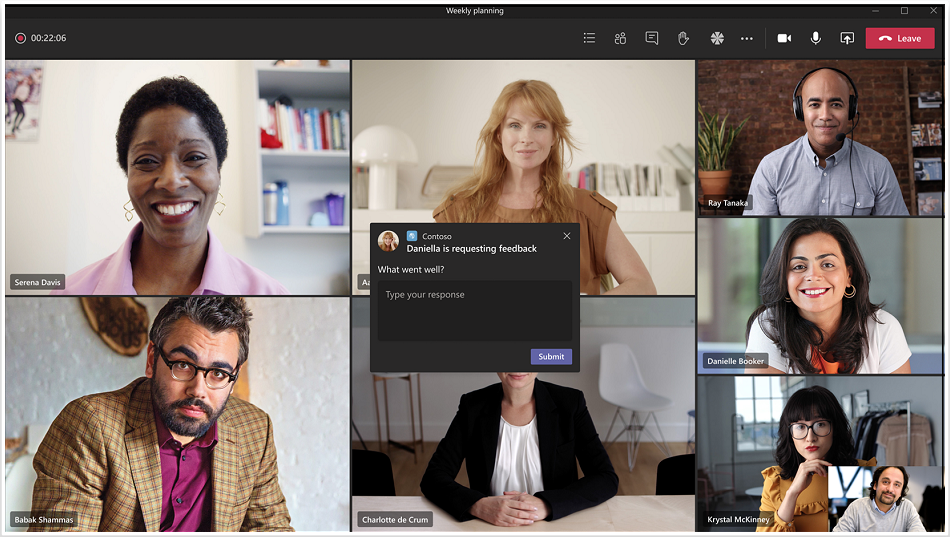
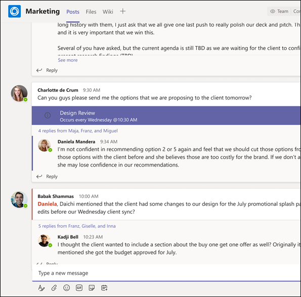

# Apps in Teams meetings

Meetings enable collaboration, partnership, informed communication, and shared feedback in an inclusive and active forum. The meeting app can deliver a user experience for each stage of the meeting lifecycle including pre-meeting, in-meeting and post-meeting app experience, depending on the attendee's status.

Teams end-users can access apps during meetings using the tab gallery, for example:

* Pre-stage a Kanban board
* Launch an in-meeting actionable dialog
* Create a post-meeting poll

Teams’ meeting app extensibility is based on the following concepts:

✔ Meeting lifecycle has stages such as before, during, and after meeting time frame.  
✔ Participant roles in a meeting such as meeting organizer, presenter, or attendee.  
✔ User types in a meeting such as in-tenant, guest, federated, or anonymous Teams user.

This article covers information about the meeting lifecycle and how to integrate tabs, bots, and messaging extensions in your meeting. It also enables you to identify participant roles and also use different user types to perform tasks.

> [!NOTE]
> To work with the meeting app extensibility features, you must have the appropriate permissions.

### Meeting lifecycle

Meeting lifecycle consists of pre-meeting, in-meeting, and post-meeting app experience. You can integrate tabs, bots, and messaging extensions in each stage of the meeting lifecycle.

## Integrate tabs into the meeting lifecycle

Tabs allow team members to access services and content in a specific space within a channel or chat. This lets the team work directly with tabs and have conversations about the tools and data available within tabs. In Teams meeting, users can add a tab by selecting plus , and choosing the app that they want to install as a tab.

> [!IMPORTANT]
> If you have integrated a tab with your meeting, then your app must follow the Teams [single sign-on (SSO) authentication flow](../tabs/how-to/authentication/auth-aad-sso.md) for tabs.

> [!NOTE]
> * Mobile clients support tabs only in pre and post meeting stages. The in-meeting experiences that is in-meeting dialog and panel are currently not available on mobile.
> * Apps are supported only in private scheduled meetings.

### Pre-meeting app experience

**Pre-meeting experience:**

**Pre-meeting tab:**

✔ Permissioned users are users who can add apps to a meeting during different stages of the meeting lifecycle. These users can add apps to a meeting through the tab gallery in two ways:

   * Using the **Details** tab on the Teams scheduling form.

   * Using the meeting **Chat** tab in an existing meeting.

✔ Tab apps are accessible in meetings **Details** and **Chats** pages using a plus ➕ button.

✔ Tab layout must be in an organized state if there are more than ten polls or surveys.

### In-meeting app experience

✔ Meeting apps are hosted in the top upper bar of the chat window and as in-meeting tab experience using the in-meeting tab. When users add a tab to a meeting through the tab gallery, apps that are **during meeting** experiences are shown.

✔ Permissioned users can add apps while in the meeting.

✔ When loaded in the context of a meeting, apps can leverage the Teams client SDK to access the `meetingId`, `userMri`, and `frameContext` to appropriately render the experience.

✔ Exporting a result of a survey or poll notifies the users that the results successfully downloaded.

✔ An app is visible in a Teams meeting in the side panel or the in-meeting dialog box. Use the in-meeting dialog box to showcase actionable content for meeting participants. For more information, see [create apps for Teams meetings](create-apps-for-teams-meetings.md).

   > [!NOTE]
   > Your app manifest specifies that your tab is [optimized for side panel](create-apps-for-teams-meetings.md#during-a-meeting), that is where it is displayed. It can also be part of a share-tray experience, subject to specified design guidelines.

The following images display the app as an in-meeting dialog box and as a separate side panel:

#### In-meeting actionable dialog for users

### Post-meeting app experience

✔ The post-meeting app scenario is similar to the current post-meeting experience with the added benefit of having tabs that exist within the surface.

✔ Permissioned users can add apps from the tab gallery to a meeting using the **Details** tab on the Teams scheduling form and the meeting **Chat** tab in an existing meeting.

✔  Tab layout must be organized when there are more than ten polls or surveys.

### Integrate bots into the meeting lifecycle

For bot implementation, start with [build a bot](../build-your-first-app/build-bot.md) and then continue with [create apps for Teams meetings](../apps-in-teams-meetings/create-apps-for-teams-meetings.md#meeting-apps-api-reference).

### Integrate messaging extensions into the meeting lifecycle

For messaging extension implementation, start with [build a messaging extension](../messaging-extensions/how-to/create-messaging-extension.md) and then continue with [create apps for Teams meetings](../apps-in-teams-meetings/create-apps-for-teams-meetings.md#meeting-apps-api-reference).

## Participant roles and user types in a meeting

### Participant roles

Default participant settings are determined by an organization's IT administrator. The following are the participant roles in a meeting:

* **Organizer**: The organizer schedules a meeting, sets the meeting options, assigns meeting roles, and starts the meeting. Only users with a M365 account with a Teams license can be organizers and control attendee permissions. A meeting organizer can change the settings for a specific meeting. Organizers can make these changes on the **Meeting options** web page.
* **Presenter**: Presenters have the same capabilities as organizer. However, a presenter cannot remove an organizer from the session or modify meeting options for the session. By default, participants joining a meeting have the presenter role.
* **Attendee**: An attendee is a user who has been invited to attend a meeting but who is not authorized to act as a presenter. Attendees can interact with other meeting members but cannot manage any of the meeting settings or share content.

Only an organizer or presenter can add, remove, or uninstall apps. Only organizer or presenter can create polls in a meeting.

For more information, see [roles in a Teams meeting](https://support.microsoft.com/office/roles-in-a-teams-meeting-c16fa7d0-1666-4dde-8686-0a0bfe16e019).

You can access the  **Meeting options** page as follows:

* In Teams, go to **Calendar** , select a meeting, and then **Meeting options**.

* In a meeting invitation, select **Meeting options**.

* During a meeting, select **Show participants**  in the meeting controls. Then, above the list of participants, choose **Manage permissions**.

### User types

> [!NOTE]
> Users with specific user types assigned to them can join meetings and assume one of the participant roles described in [participant roles](#participant-roles). The user type is not included in the **getParticipantRole** API.

The following user types identify what each user can do and what they can access:

* **In-tenant**: In-tenant users belong to the organization and have credentials in Azure Active Directory (AAD) for the tenant. They are usually full-time, onsite, or remote employees. An in-tenant user can be an organizer, presenter, or attendee.
* **Guest**: A guest is a participant from another organization invited to access Teams or other resources in the organization's tenant. Guests are added to your organization’s AAD and have the same Teams capabilities as a native team member with access to team chats, meetings, and files. A guest user can be an organizer, presenter, or attendee. For more information, see [guest access in Teams](/microsoftteams/guest-access).
* **Federated or external**: A federated user is an external Teams user in another organization who has been invited to join a meeting. These users have valid credentials with federated partners and are authorized by Teams. They do not have access to your teams or other shared resources from your organization. Guest access is a better option for external users to have access to teams and channels. For more information, see [manage external access in Teams](/microsoftteams/manage-external-access).
* **Anonymous**: Anonymous users do not have an AAD identity and are not federated with a tenant. The anonymous participant is like an external user, but their identity is not projected in the meeting. An anonymous user cannot be an organizer but can be a presenter or an attendee.

> [!NOTE]
> Anonymous users inherit the global default user-level app permission policy. For more information, see [Manage Apps](/microsoftteams/non-standard-users#anonymous-user-in-meetings-access).

The following table provides the user types and what features each user can access:

| User type | Tabs | Bots | Messaging extensions | Adaptive Cards | Task modules | In-meeting dialog |
| :-- | :-- | :-- | :-- | :-- | :-- | :-- |
| Anonymous user | Not available | Not available | Not available | Interactions in the meeting chat are allowed. | Interactions in the meeting chat from an Adaptive Card are allowed. | Not available |
| Guest that is part of the tenant AAD | Interaction is allowed. Creating, updating, and deleting are not allowed. | Not available | Not available | Interactions in the meeting chat are allowed. | Interactions in the meeting chat from an Adaptive Card are allowed. | Available |
| Federated user. For more information, see [non-standard users](~/non-standard-users). | Interaction is allowed. Creating, updating, and deleting are not allowed. | Interaction is allowed. Acquiring, updating, and deleting are not allowed. | Not available | Interactions in the meeting chat are allowed. | Interactions in the meeting chat from an Adaptive Card are allowed. | Not available |

## See also

> [!div class="nextstepaction"]
> [Tab](../tabs/what-are-tabs.md#how-do-tabs-work)

> [!div class="nextstepaction"]
> [Bot](../bots/what-are-bots.md)

> [!div class="nextstepaction"]
> [Messaging extension](../messaging-extensions/what-are-messaging-extensions.md)

> [!div class="nextstepaction"]
> [Design your app](../apps-in-teams-meetings/design/designing-apps-in-meetings.md)

## Next steps

> [!div class="nextstepaction"]
> [Build your app](create-apps-for-teams-meetings.md)
