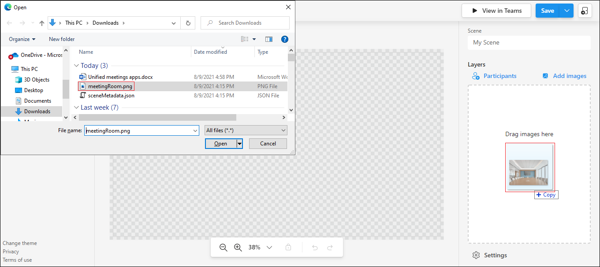
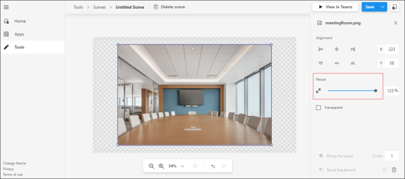
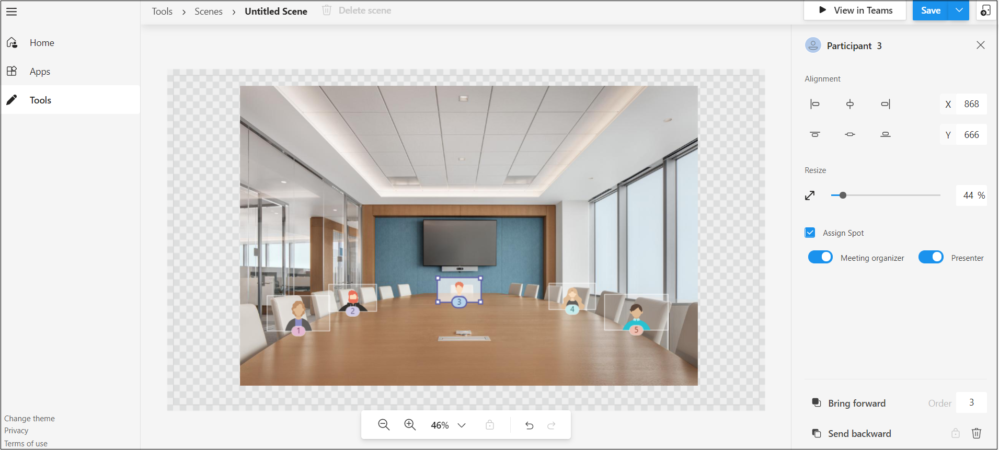
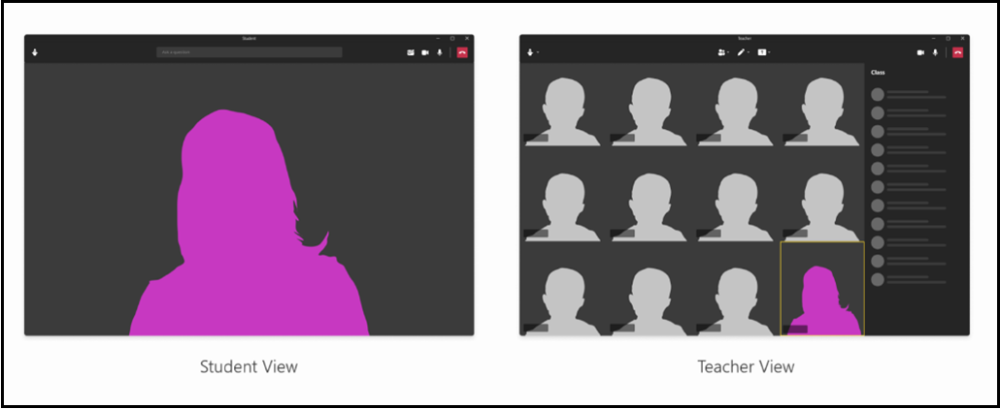
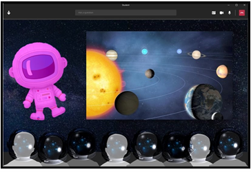
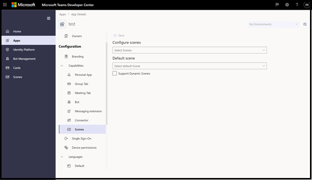

# Together Mode in Teams

Microsoft Teams Together Mode provides an immersive and engaging meeting environment that brings people together and encourages them to turn on their video. It digitally combines participants into a single virtual scene and places their video streams in pre-determined spots designed and fixed by the scene creator.

> [!VIDEO https://www.youtube-nocookie.com/embed/MGsNmYKgeTA]

Scenes in Together Mode is an artifact created by the scene developer using the Microsoft Scene Design Studio that brings together people along with their video stream in a creative setting as conceived by the scene creator. A scene brings people together with designated seats in the conceived scene setting and with participant video streams rendered in those seats.

>[!NOTE]
> Scene only apps are recommended as the acquisition experience for such apps is more seamless.

The following image gives an overview to create a scene only app:

:::image type="content" source="../assets/images/apps-in-meetings/scene-added-to-app.png" alt-text="Add scene to app" border="false":::

A scene only app is still an app in Microsoft Teams. The app package creation step is abstracted out since the Scene Design Studio handles the app package creation in the background.

>[!NOTE]
> Multiple scenes in a single app package appear as a flat list of scenes to users.

There are prerequisites that you must complete before using the Together Mode.

## Prerequisites

You must have a basic understanding of the following to use Together Mode:

* Definition of scene and seats in a scene.
* Have a Microsoft Developer account and be familiar with the Microsoft Teams Dev Center and App Studio.
* [Concept of app sideloading](../concepts/deploy-and-publish/apps-upload.md).

## Build a scene using the Scene Design Studio

>[!NOTE]
> This document is referring to Scene Design Studio in the Microsoft Teams Dev Center. The interface and functionalities are all same in App Studio Scene Designer.

Microsoft has a Scene Design Studio that allows you to build the scenes. It is available on the [Teams Dev Center](https://dev.teams.microsoft.com/scenes).

A scene in the context of the Scene Design Studio is an artifact that contains the following:

* Seats reserved for meeting organizer and meeting presenters. Presenters does not refer to the user who is actively sharing. It refers to the [meeting role](https://support.microsoft.com/en-us/office/roles-in-a-teams-meeting-c16fa7d0-1666-4dde-8686-0a0bfe16e019).
* Each seat and image have a width and height. PNG is the only supported format.
* The xyz coordinates of all the seats and images.
* A collection of images that are camouflaged as one image.

The following image shows each seat represented as an avatar for development purposes:


The seat dimensions become the canvas for rendering the participant video stream.

The following image shows you how to get the scene package as a zip file that contains all the scene assets:


Assets include PNG images used to create the scene and a scene.json file that captures the scene metadata.

>[!NOTE]
> Scene package can be used for sharing and allowing other co-creators to continue enhancing the scene. The **Import a scene** option can be used for this purpose.


**To build a scene using the Scene Design Studio**

1. Go to [Teams Dev Center](https://dev.teams.microsoft.com/scenes).

2. Select **Tools** from the menu and then select **Scene editor** under **Tools** to open the Scene Design Studio.

3. From the **Scenes Editor** page, select **Create a new scene**.

4. On the right side, in the **Scene Name** box, enter a name for the scene.

5. Drag and drop the image into the environment as displayed in the following image:

    >[!NOTE]
    > * You can download the zip files with the images from [sample-app](../apps-in-teams-meetings/Sample App-1.zip) and [sample-scene](../apps-in-teams-meetings/Sample-Scene-1.zip)
    > * Alternately, you can add background images to the scene using **Add images**.

    

6. Select an image that you have placed in the scene. From the rightmost pane, select an alignment for the image or use the **Size & rotation** slider to adjust the image size.

    

7. Select **Participants** under **Layers** in the upper-right corner.

8. Select the number of participants for the scene from the **Number of participants** box, and select **Add**. After the scene is shipped, the avatar placements are replaced with actual participant's video streams.

    >[!NOTE]
    > You can drag the participant images around the scene and place them in the required position and resize them using the resize arrow.

9. Select any participant image, select the **Assign Spot** check box, and select **Meeting Organizer** and **Presenter** to assign that spot to the participant.

    >[!NOTE]
    > Alternately, you can select either **Meeting Organizer** or **Presenter** options for that participant.

    

10. Select **Export the Scene** from the **Save** drop-down menu. A .ZIP file, that is the scene package, is downloaded.

    >[!NOTE]
    > Alternately, you can select **Save** to save the scene.

After you have built a scene using the Scene Design Studio, you can assemble a scene package.

## Assemble a scene package

A scene package is a collection of images, scene JSON, and all assets. A scene package is used to build the scene and a scene JSON to indicate the exact position of the seats.

You can ship a scene package that includes the following:

* **Role based scene:** Within a scene package, you can render an experience preview for the users.

    

* **In scene configuration:** The JSON package takes a single image with seat assignment. For example, in the following image, the astronaut seat can be applied by default to the organizer through `participantRole` API, but the user can dynamically move the seat around using the class roster:

    

* **Moving images:** You can support scenes that are in motion to simulate moving objects. One way of doing that is to support GIF format in Together Mode. Advanced scene rendering is more like a movie being played.

* **Visual no-code designer experience:** Users can build their own filters using Snap's graphical user interface (GUI). It is a challenge to ship a scene generic enough for all users to use it. At present users can create custom scenes that serve the purpose.

### Sample JSON

Scene JSON along with the images indicates the exact position of the seats. A scene consists of bitmap images, sprites, and rectangles to put participant videos in. These sprites and participant boxes are defined in a world coordinate system with the X-axis pointing to the right and the Y-axis pointing downwards. Together mode supports zooming in on the current participants. This is helpful for small meetings in a large scene. A sprite is a static bitmap image positioned in the world. The Z value of the sprite determines which sprite should be rendered on top of which. Rendering starts with the sprite with lowest Z value, so higher Z value means it is closer to the camera. Each participant has its own video feed which will be segmented so that only the foreground is rendered.

Following is the scene JSON sample:

```json
{
   "protocolVersion": "1.0",
   "id": "A",
   "autoZoom": true,
   "mirrorParticipants ": true,
   "extent":{
      "left":0.0,
      "top":0.0,
      "width":16.0,
      "height":9.0
   },
   "sprites":[
      {
         "filename":"background.png",
         "cx":8.0,
         "cy":4.5,
         "width":16.0,
         "height":9.0,
         "zOrder":0.0,
   "isAlpha":false
      },
      {
         "filename":"table.png",
         "cx":8.0,
         "cy":7.0,
         "width":12.0,
         "height":4.0,
         "zOrder":3.0,
   "isAlpha":true
      },
      {
         "filename":"row0.png",
         "cx":12.0,
         "cy":15.0,
         "width":8.0,
         "height":4.0,
         "zOrder":2.0,
   "isAlpha":true
      }

   ],
   "participants":[
      {
         "cx":5.0,
         "cy":4.0,
         "width":4.0,
         "height":2.25,
         "zOrder":1.0,
         "seatingOrder":0
      },
      {
         "cx":11.0,
         "cy":4.0,
         "width":4.0,
         "height":2.25,
         "zOrder":1.0,
         "seatingOrder":1
      }
   ]
}
```

Each scene has a unique ID and name. The scene JSON also contains information on all the assets used for the scene. Each asset contains a filename, width, height, and position on the X and Y-axis. Similarly, each seat contains a seat ID, width, height, and position on the X and Y-axis. The seating order is generated automatically for each seat when it is created.

>[!NOTE]
> Seating order number corresponds to the order of people joining the call.

The seating order can be altered according to the preferred order.

The zOrder represents the order of placing images and seats along the Z-axis. In many cases, it gives a sense of depth or partition if required.

Now that you have assembled a scene package, you can create an app package and apply the scene in Teams.

## Create an app package and use the scene in Teams

An app package contains the scene package. App Studio simplifies app packaging.



**To create an app package and use the scene in Teams**

1. Go to **Apps** in **App Studio** in Teams.

2. Create a new app and enter the necessary details in the app details page.

3. In the **Microsoft Teams Developer Center** page, go to **Scenes** under **Configuration** in **Apps**.

4. Select the scene you built and import the package.

5. Sideload this package in Teams.

Now that you have created an app package and uploaded the scene in Teams, you can activate the Together Mode to engage in scenes.

## Activate the Together Mode

Get end-to-end information of how an end user engages with scenes in Together Mode.

**To choose scenes and activate the Together Mode**

1. From the **Gallery** drop-down in the upper-left corner, select **Change scene** to change the default scene. The **Choose a scene** dialog box appears.

2. From **Choose a scene**, select the scene you want to use for your meeting.

    

3. Choose **Switch all participants to together mode** in the meeting.

4. Select **Apply**. Teams installs the app for the user and applies the scene.

    

## See also

> [!div class="nextstepaction"]
> [Create your app package](../concepts/build-and-test/apps-package.md)
