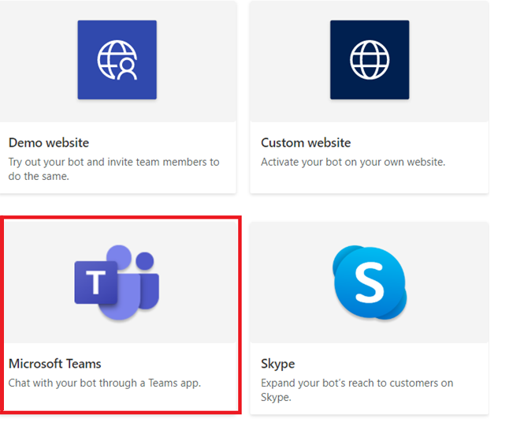

# Integrate your Power Virtual Agents chatbot with Microsoft Teams

Power Virtual Agents empowers every member of your team to create rich, conversational chatbots that easily integrate with the Teams platform. Your IT administrators, business analysts, domain specialists, and skilled app developers can design, develop and publish intelligent virtual agents for Teams without having to setup a development environment, create a web service, or directly register with the Bot Framework.  
*See* [Create a chatbot for Teams with Microsoft Power Virtual Agents](../what-are-bots.md).

> [!NOTE]
> By adding the bot to Microsoft Teams, some of data, such as bot content and end-user chat content, will be shared with Microsoft Teams (meaning that your data will flow outside of your [organization’s compliance and geographic or regional boundaries](/power-virtual-agents/data-location)).  
> For more information, see the [Security and compliance in Microsoft Teams](/MicrosoftTeams/security-compliance-overview).

## Create a Teams channel in the Power Virtual Agents portal

1. After you have created a chatbot in the [Power Virtual Agents portal](https://powervirtualagents.microsoft.com), you can configure a Teams channel to connect with the Teams platform.

2. Once the Teams channel has been successfully added to your chatbot, an **App Id** will be available in the dialog box. Copy and save the App Id. — you will need it later to create an app package for Teams.

## Add your bot to Teams using App Studio

App Studio is a Teams app that you can install from the Teams store. It simplifies the creation and registration of an app.

1. To install App Studio in Teams, select the app store icon at the bottom of the left nav bar, and search for App Studio.
>

2. Select the **App Studio** tile and choose **Install** in the pop-up dialog box.
>

3. Once App Studio is installed, select **Manifest editor**  => **Create a new app**.
1. Add your app details (see [manifest schema definition](../../resources/schema/manifest-schema.md) for a full descriptions of each field).
1. On the **Bots** tab select the **Setup** button.
1. Select **Existing bot** and enter the bot name.
1. Select **Connect to a different bot id** and paste the **App ID** you copied earlier. Under scope, select **Personal** and then select **Save**.
1. Select the **Test and distribute** tab and choose **Install** to add your bot directly to your Teams instance. Optionally, you can download your completed app package to share with Team users.
1. The setup process for adding your Power Virtual Agents chat bot to Teams is complete. For more details, *see* [Add bot to Microsoft Teams](/power-virtual-agents/publication-add-bot-to-microsoft-teams).

> [!div class="nextstepaction"]
> [Learn more about publishing your Power Virtual Agents bot to channels](/power-virtual-agents/publication-fundamentals-publish-channels)