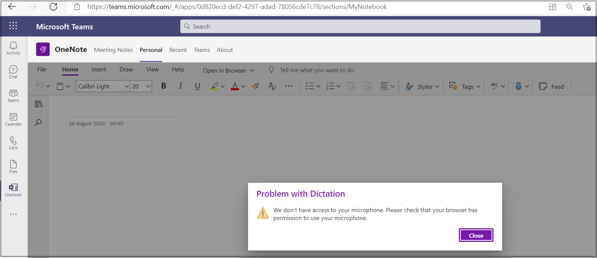

# Device permissions for the browser

Users can grant consent to each app and consent to device permissions. Previously browser level permissions were handled as a top level permission for Teams and not per app basis. Earlier the browser handled permissions but now Teams needs to handle permissions on per app basis. At the browser level there are two levels of permissions, one is the Teams overall permission for the browser and the other Teams controls individual permissions for each app.

Device permission requests cannot be intercepted from iframe. You can only allow or deny permissions before the iframe is loaded. The user must know which device permissions to enable before the tab has loaded to enhance their experience. If the user needs to change the permissions, they need to reload the iframe. The following image demonstrates the device permissions flow for granting or denying access:

## Scenario

Sarah, a lawyer at Contoso Partners, uses OneNote to take meeting notes in Teams. Sarah opens Teams in the browser. OneNote requires microphone access to record dictations. Sarah is shown a dialog box prompting her to grant access. Sarah only uses OneNote to take notes and decides to deny access.

A few months later, Sarah needs to record an important meeting. Sarah decides to use the dictation feature of OneNote. But a dialog box appears, stating that Sarah doesn’t have microphone access as she had denied access earlier.

Sarah then checks her app permissions or settings in Teams to grant OneNote access to her microphone.

## Solution

The solution for the security of applications covers the following points:

* Introduce device permissions consent experience in the browser: All apps' permissions are managed individually instead of relying on the browser to provide the support.
* Allow users to manage their device permissions for each app in the browser: Previously device permissions for embedded iframes were handled by the browser. With the recent change to Chromium, users can manage their device permissions for each Teams tab through the **Settings** dialog box.

Users can have various apps in Teams and each require device permissions. For example, in OneNote the user must grant permissions for media, such as microphone. There's a property on iframe that allows the user to use different media for that app.

User can manage device permissions in context through the **App permissions** button, app drop-down, or **Settings**.

**To grant access to app for device permissions using the App permissions button**

1. In your browser, open [teams.microsoft.com](https://teams.microsoft.com/).
1. Select the app, for example, OneNote that you want to use from the left bar.

    

1. Select **App permissions** from the upper right corner.

    

1. Turn on **Media (Camera, microphone, speakers)** and close the dialog box.

    

1. Select **Refresh now** to reload the page for new iframe permissions to take effect.
1. If you're using OneNote, you can select **Dictate** to record your notes as the permissions to microphone are granted.

**To grant access to app for device permissions using the drop-down for a team**

1. In your browser, open [teams.microsoft.com](https://teams.microsoft.com/).
1. Select a team from Teams where you you want to use an app.
1. Add the app like OneNote if it isn't already added.
1. Select the drop-down for **My Notebook** in this case.

    

1. Select **App permissions**.

    

1. Turn on **Media (Camera, microphone, speakers)** and close the dialog box.

    

1. Select **Refresh now** to reload the page.
1. If you're using OneNote, you can select **Dictate** to record your notes as the permissions to microphone are granted.

**Optionally to grant access to app for device permissions using Settings**

1. In your browser, open [teams.microsoft.com](https://teams.microsoft.com/).
1. Select the app, for example, OneNote that you want to use from the left bar.
1. If you're using OneNote, you can select **Dictate** to record your notes. A dialog box appears to state the permissions are denied.
1. Select the icon for your user account from the upper right corner and select **Manage account**.
1. From the **Settings** dialog box, select **App permissions**.

    

1. Select the app where you want to grant access.
1. Turn on **Media (Camera, microphone, speakers)**.

    

1. In your browser, select **Refresh**. A dialog box appears asking you to reload the page.
1. Select **Refresh now** to reload the page for new iframe permissions to take effect.
1. Similarly, you can turn on other permissions, such as location or MIDI device as required to use the app.

## See also

* [Device capabilities overview](device-capabilities-overview.md)
* [Request device permissions](native-device-permissions.md)