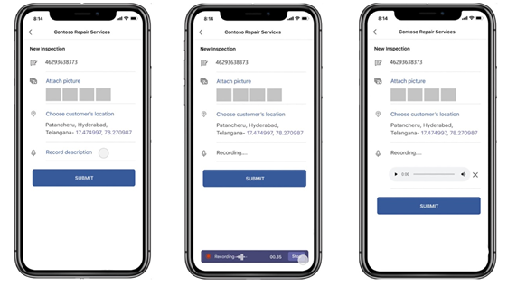

# Media capabilities in Teams

>[!IMPORTANT]
>
>* Currently, the Microsoft Teams support for media capabilities, such as camera, image, location, and Microphone is only available for mobile clients.
>* The `selectMedia`, `getMedia`, and `viewImages` APIs can be invoked from multiple Teams surfaces such as task modules, tabs, and personal apps. For more details, _see_ [Entry points for Teams apps](../extensibility-points.md).
>* `selectMedia` API has been extended to support mic and audio properties. 

You must use the  [Microsoft Teams JavaScript client SDK](/javascript/api/overview/msteams-client?view=msteams-client-js-latest&preserve-view=true), to easily integrate media  capabilities within your Teams mobile app. The SDK provides the tools necessary for your app to access a user’s [device permissions](native-device-permissions.md?tabs=desktop#device-permissions) and build a richer experience.

The [selectMedia](/javascript/api/@microsoft/teams-js/media?view=msteams-client-js-latest#selectMedia_MediaInputs___error__SdkError__attachments__Media_______void_&preserve-view=true), [getMedia](/javascript/api/@microsoft/teams-js/_media?view=msteams-client-js-latest#getMedia__error__SdkError__blob__Blob_____void_&preserve-view=true), and [viewImages](/javascript/api/@microsoft/teams-js/media?view=msteams-client-js-latest#viewImages_ImageUri_____error___SdkError_____void_&preserve-view=true) APIs enable you to use native media capabilities as follows:

* Use native **Microphone** to allow users to **record audio** from the device.
* Use native **camera control** to allow users to **capture and attach images** on the go.
* Use native **gallery support** to allow users to **select device images** as attachments.
* Use native **image viewer control** to **preview multiple images** at one time.
* Support **large image transfer** (up to 50 MB) via the SDK bridge
* Support **advanced image capabilities** allowing users to preview and edit images:
  * Scan document, whiteboard, business cards, etc., through the camera.
  * Crop and rotate the images.
  * Add text, ink, or freehand annotation to the image.
## Get started

Update your Teams app [manifest.json](../../resources/schema/manifest-schema.md#devicepermissions) file by adding the `devicePermissions`  property and specifying `media`. This allows your app to ask for requisite permissions from users before they use the camera to capture the image or open the gallery to select an image to submit as an attachment.

``` json
"devicePermissions": [
    "media",
],
```

> [!NOTE]
> The _Request Permissions_ prompt is automatically displayed when a relevant Teams API is initiated. For more details, *see* [Request device permissions](native-device-permissions.md).

## Using media capability APIs

You must use the following set of APIs to enable your device's media capabilities:

| API      | Description   |
| --- | --- |
| [**selectMedia**](/javascript/api/@microsoft/teams-js/media?view=msteams-client-js-latest&branch=master#selectMedia_MediaInputs___error__SdkError__attachments__Media_______void_&preserve-view=true)| This API allows users to **capture or select media from a native device** and return to the web-app. Users may choose to edit, crop, rotate, annotate, or draw over images before submission. In response to **selectMedia**, the web-app receives media ids of selected images and a thumbnail of the selected media. <br/>This API allows users to record audio from a native device and return to the web-app. Users may choose to pause, re-record and play recording preview before submission. In response to selectMedia, the web-app will receive media ids of selected audio recording. Mediatype needs to be set to 4 for audio. |
| [**getMedia**](/javascript/api/@microsoft/teams-js/_media?view=msteams-client-js-latest&branch=master#getMedia__error__SdkError__blob__Blob_____void_&preserve-view=true)| This API retrieves the media in chunks irrespective of size. These chunks are assembled and sent back to the web app as a file/blob. With this API an image is broken into smaller chunks to facilitate large image transfer. |
| [**viewImages**](/javascript/api/@microsoft/teams-js/media?view=msteams-client-js-latest#viewImages_ImageUri_____error___SdkError_____void_&preserve-view=true)| This API enables the user to view images full-screen mode as a scrollable list.|

**Web app experience for selectMedia API for image capability**


**Web app experience for selectMedia API for microphone capability**


## Configurations

| Configuration-`selectMedia` | Description |
| --- | --- |
| maxDuration | Maximum duration in minutes after which the recording terminates (max limit 10) 

## Sample code snippets

**Calling `selectMedia` API**

```javascript
let imageProp: microsoftTeams.media.ImageProps = {
    sources: [microsoftTeams.media.Source.Camera, microsoftTeams.media.Source.Gallery],
    startMode: microsoftTeams.media.CameraStartMode.Photo,
    ink: false,
    cameraSwitcher: false,
    textSticker: false,
    enableFilter: true,
};
let mediaInput: microsoftTeams.media.MediaInputs = {
    mediaType: microsoftTeams.media.MediaType.Image,
    maxMediaCount: 10,
    imageProps: imageProp
};
microsoftTeams.media.selectMedia(mediaInput, (error: microsoftTeams.SdkError, attachments: microsoftTeams.media.Media[]) => {
    if (error) {
        if (error.message) {
            alert(" ErrorCode: " + error.errorCode + error.message);
        } else {
            alert(" ErrorCode: " + error.errorCode);
        }
    }
    if (attachments) {
        let y = attachments[0];
        img.src = ("data:" + y.mimeType + ";base64," + y.preview);
    }
});
```

**Calling `getMedia` API**

```javascript
let media: microsoftTeams.media.Media = attachments[0]
media.getMedia((error: microsoftTeams.SdkError, blob: Blob) => {
    if (blob) {
        if (blob.type.includes("image")) {
            img.src = (URL.createObjectURL(blob));
        }
    }
    if (error) {
        if (error.message) {
            alert(" ErrorCode: " + error.errorCode + error.message);
        } else {
            alert(" ErrorCode: " + error.errorCode);
        }
    }
});
```

**Calling `viewImages`  API by ID**

```javascript
view images by id:
    assumption: attachmentArray = select Media API Outputlet uriList = [];
if (attachmentArray && attachmentArray.length > 0) {
    for (let i = 0; i < attachmentArray.length; i++) {
        let file = attachmentArray[i];
        if (file.mimeType.includes("image")) {
            let imageUri = {
                value: file.content,
                type: 1,
            }
            uriList.push(imageUri);
        } else {
            alert("File type is not image");
        }
    }
}
if (uriList.length > 0) {
    microsoftTeams.media.viewImages(uriList, (error: microsoftTeams.SdkError) => {
        if (error) {
            if (error.message) {
                output(" ErrorCode: " + error.errorCode + error.message);
            } else {
                output(" ErrorCode: " + error.errorCode);
            }
        }
    });
} else {
    output("Url list is empty");
}
```

**Calling viewImages API by URL**

```javascript
View Images by URL:
    // Assumption 2 urls, url1 and url2let uriList = [];
    if (URL1 != null && URL1.length > 0) {
        let imageUri = {
            value: URL1,
            type: 2,
        }
        uriList.push(imageUri);
    }
if (URL2 != null && URL2.length > 0) {
    let imageUri = {
        value: URL2,
        type: 2,
    }
    uriList.push(imageUri);
}
if (uriList.length > 0) {
    microsoftTeams.media.viewImages(uriList, (error: microsoftTeams.SdkError) => {
        if (error) {
            if (error.message) {
                output(" ErrorCode: " + error.errorCode + error.message);
            } else {
                output(" ErrorCode: " + error.errorCode);
            }
        }
    });
} else {
    output("Url list is empty");
}
}
```
