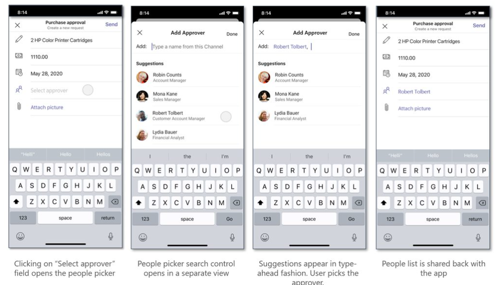

# Integrate people picker control capability 

This document guides you on how to integrate people picker control capability of Teams platform with your Teams app.  
You can use [Microsoft Teams JavaScript client SDK](/javascript/api/overview/msteams-client?view=msteams-client-js-latest&preserve-view=true), which provides the people picker API to integrate the people picker control capability within your app. 

## Advantages of integrating people picker control capability

* The `People Picker` API enables you to add a people picker control to your web apps, which can be surfaced in a task module, as a tab or personal app. 
* This cross platform control allows users to select entities, such as users in a group, chat, channel, or add users through composite entities, such as DLs, SGs and tags. 
* The people picker control capability helps to make the scenarios such as task assignment, tagging or notifying a user, easy. 

To integrate people picker control capability, you must call the people picker API. For effective integration, you must have a good understanding of [code snippets](#code-snippets) for calling the location APIs. 
It is important to familiarize yourself with the [API response errors](#error-handling) to handle the errors in your Teams app.

> [!NOTE] 
> Currently, Microsoft Teams support for people picker control capability is only available for mobile clients.

## People picker API 

`People picker` API enables you to add Teams’ native People Picker input control to your webapps. This API returns information of picked users back to the calling webapp 
You must use the following set of APIs to enable your device's location capabilities:

| API      | Description   |
| --- | --- |
|`selectPeople`|Launches a people picker and allows the user to select one or more people from the list.<br/><br/>If the app is added to personal app scope the people picker launched is org wide and if the app is added to a chat/channel, people picker launched is also limited to the members of chat or channel.|

The People Picker API comes along with following input configurations:

|Configuration parameter|Type|Option|Description| Default value|
|-----|------|----------|--------------|------|
|`title`| String|Optional| Set title for the people picker.| Add people|
|`setSelected`|String| Optional| AAD IDs of the users to be pre-populated in the search box of people picker control. If single select enables this value, only the first user in the list will be pre-populated.| Null |
|`openOrgWideSearchInChatOrChannel`|Boolean | Optional|This parameter launches the people picker in organization wide scope even if the app is added to a chat or channel. | False |
|`singleSelect`|Boolean| Optional| This parameter launches the people picker for which only one person can be selected. | False|

**Web app experience for people picker control capability**


## Error handling

You must ensure to handle the errors appropriately in your Teams app. The following table lists the error codes and the conditions under which the errors are generated: 

|Error code |  Error name     | Condition|
| --------- | --------------- | -------- |
| **100** | NOT_SUPPORTED_ON_PLATFORM | API is not supported on the current platform.|
| **500** | INTERNAL_ERROR | Internal error is encountered while launching people picker.|
| **1000** | NETWORK_ERROR | Network issue.|
| **4000** | INVALID_ARGUMENTS | One or more arguments are invalid.|
| **8000** | USER_ABORT |User cancelled the operation.|
| **9000** | OLD_PLATFORM | Platform code is old and doesn't implement this API.|

## Code snippets

**Calling `selectPeople` API** for selecting people from a list:

```javascript
microsoftTeams.people.selectPeople((error, people) => {                    if (error) {
                        if (error.message) {
                            alert(" ErrorCode: " + error.errorCode + error.message);
                        }
                        else {
                            alert(" ErrorCode: " + error.errorCode);
                        }
                    }
                    if (people) {
                        output(" People length: " + people.length + " " + JSON.stringify(people));
                    }
                });
```
## See also

* [Integrate media capabilities in Teams](mobile-camera-image-permissions.md)
* [Integrate QR code or barcode scanner capability in Teams](qr-barcode-scanner-capability.md)
* [Integrate location capabilities in Teams](location-capability.md)
