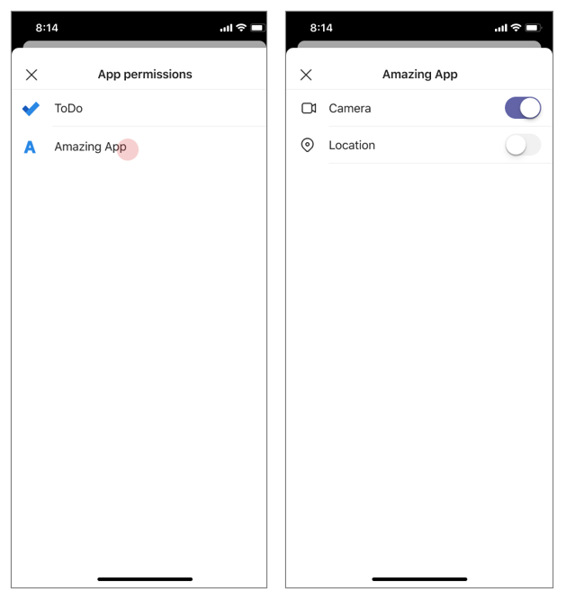

# Request device permissions for your Microsoft Teams tab

You might want to enrich your tab with features that require access native device functionality like:

* Camera
* Microphone
* Location
* Notifications

> [!IMPORTANT]
>
> Mobile client supports only camera and location through native device capabilities but on all app constructs including tabs. It supports camera to capture only images through [captureImage](/javascript/api/@microsoft/teams-js/microsoftteams?view=msteams-client-js-latest#captureimage--error--sdkerror--files--file-------void-) API.
>
> The geolocation API is currently not fully supported on all desktop clients.


## Device permissions

Accessing a user’s device permissions allows you to build much richer experiences, for example:

* Record and share short videos
* Record short audio memos and save them for later
* Use user location information to display relevant information

While access to these features are standard in most modern web browsers, you need to let Teams know which features you’d like to use by updating your app manifest. This will allow you to ask for permissions, the same way you would in a browser, while your app is running on the Teams desktop client.

## Manage permissions

To manage permissions in desktop, navigate to Settings > Permissions


To manage permissions in mobile, navigate to Settings > App permissions > [App name]


## Properties

Update your app's `manifest.json` by adding `devicePermissions` and specifying which of the five properties you’d like to use in your application:

``` json
"devicePermissions": [
    "media",
    "geolocation",
    "notifications",
    "midi",
    "openExternal"
],
```
> [!Note]
>
> Media is also used for camera permissions in mobile.

Each property will allow you to prompt the user to ask for their consent

| Property      | Description   |
| --- | --- |
| media         | permission to use the camera, microphone and speakers |
| geolocation   | permission to return the user's location      |
| notifications | permission to send the user notifications      |
| midi          | permission to send and receive midi information from a digital musical instrument   |
| openExternal  | permission to open links in external applications  |

## Checking permissions from your tab

Once you’ve added `devicePermissions` to your app manifest, you can check permissions using the HTML5 “permissions” API without causing a prompt.

``` Javascript
// Different query options:
navigator.permissions.query({ name: 'camera' });
navigator.permissions.query({ name: 'microphone' });
navigator.permissions.query({ name: 'geolocation' });
navigator.permissions.query({ name: 'notifications' });
navigator.permissions.query({ name: 'midi', sysex: true });

// Example:
navigator.permissions.query({name:'geolocation'}).then(function(result) {
  if (result.state == 'granted') {
    // Access granted
  } else if (result.state == 'prompt') {
    // Access has not been granted
  }
});
```

## Prompting the user

In order to show a prompt to get consent to access device permissions you need to leverage the appropriate HTML5 or Teams API. For example, in order to prompt the user to access their camera you need to call `getCurrentPosition`

```Javascript
navigator.geolocation.getCurrentPosition(function (position) { /*... */ });
```

To use camera on desktop or web, Teams will show a permission prompt when you call getUserMedia

```Javascript
navigator.mediaDevices.getUserMedia({ audio: true, video: true });
```

To capture image on mobile, Teams mobile will ask for permission when called captureImage()

```Typescript
function captureImage(callback: (error: SdkError, files: File[]) => void)
```

Notifications will prompt the user when you call `requestPermission`

```Javascript
Notification.requestPermission(function(result) { /* ... */ });
```


## Permission behavior across login sessions

Native device permissions are stored per login session. This means that if you log into another instance of Teams (ex: on another computer), your device permissions from your previous sessions will not be available. Instead, you will need to re-consent to device permissions for the new login session. This also means, if you log out of Teams (or switch tenants inside of Teams), your device permissions will be deleted for that previous login session. Please keep this in mind when developing native device permissions: the native capabilities you consent to are only for your _current_ login session.
